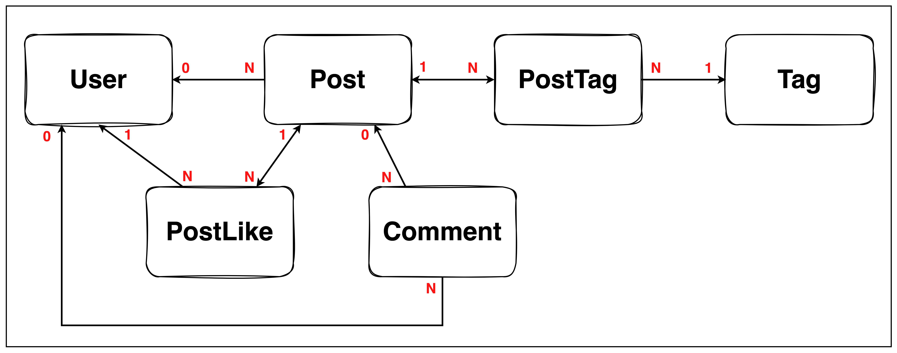

# Post, Comment API 개발

---

### ERD


- User(1) : Post(N)
    - 1 ← N 단방향 관계
- User(1) : Comment(N)
    - 1 ← N 단방향 관계
- Post(1) : Comment(N)
    - 1 ← N 단방향 관계
- Post(1) : PostLike(N)
    - N ← 1 단방향 관계
    - 1 → N 단방향 관계
- Post(N) : Tag(M)
    - N : M 관계 → 연결 엔티티(PostTag) 활용
    - Post(1) : PostTag(N)
        - N ← 1 단방향 관계
        - 1 → N 단방향 관계
    - Tag(1) : PostTag(N)
        - 1 ← N 단방향 관계

---

### 주요 작업 목록

- 게스트, 로그인 유저의 API 요청 권한(Authorization) 확인
- Post
    - Post Create API
    - Post Details Read API
    - Post List Read API
    - Post Like API
- Comment
    - Comment Create API
    - Comment List Read API
    - Sub Comment List Read API

---

### 주요 작업 과정

- **게스트, 로그인 유저의 API 요청 권한(Authorization) 확인 작업**
    - MVP(Minimum Viable Product) 단계에서 애플리케이션 내 유저 레벨이 세부적으로 나뉘지 않아 인증 여부 자체가 요청 권한(인가) 의미
    - API 별로 인증 요구 사항 구분
        - 예) Post Create API - 로그인 유저만 요청 가능
        - 예) Post Details Read API - 게스트, 로그인 유저 모두 요청 가능
    - JWT 토큰 기반의 인증 방식 내에서 API 요청 시점마다 인증 여부 확인

    - [Spring MVC의 Handler Interceptor에서 인증 처리 과정 정리(link)](https://www.notion.so/Spring-MVC-Handler-Interceptor-81fc3d28c8f74959afe5de592a3ccfcf)


---

- **Post Details Read API**
    - 포스트 상세 조회 페이지 내에서 댓글 리스트 조회 처리
        - Post(1) : Comment(N), 1 ← N 단방향 연관관계 지정
        - Post → Comment (@OneToMany) 방향으로 연관관계를 지정하게 되면 한 포스트에 달린 댓글의 양이 많은 경우 부하가 커지는 구조를 갖게 됨
        - 따라서 JPA의 글로벌 로딩 전략에 의존하지 않고 Comment List Read API를 활용해 포스트 상세 조회 시 해당 포스트에 달린 댓글 리스트 조회 처리
    - 포스트에 달린 태그 리스트 조회 처리
        - 포스트에는 최대 20개의 태그를 지정할 수 있음
        - Post(N) : Tag(M)
            - N : M 관계를 가지므로, 연결 엔티티인 PostTag를 기점으로 아래와 같이 관계 지정
                - Post(1) : PostTag(N), 1 ← N & 1 → N 두 개의 단방향 관계 지정
                - Tag(1) : PostTag(N), 1 ← N 단방향 연관관계 지정
        - Post → PostTag (@OneToMany) 방향으로 포스트 태그 리스트를 조회한 뒤, 포스트 태그 리스트의 태그 아이디를 기준으로 태그 이름을 조회하는 순서로 처리되고, 이 과정에서 N + 1 문제가 발생
            - N + 1 문제가 있는 상태에서의  쿼리

                ```json
                // 포스트 상세 조회 응답 (태그 5개가 등록된 경우)
                {
                    "id": 1,
                    "parentCategory": "FREE_TOPIC",
                    "childCategory": "FREE_THREAD",
                    "authorName": "YOUN",
                    "title": "title",
                    "content": "content",
                    "tags": [
                        "java",
                        "spring",
                        "jpa",
                        "mysql",
                        "junit5"
                    ],
                    "liked": true,
                    "likesCount": 1,
                    "createdAt": "2023-04-04T01:00:07",
                    "updatedAt": "2023-04-04T01:00:07"
                }
                ```

                ```sql
                -- 포스트 ID를 기준으로 포스트 테이블 조회
                Hibernate: 
                    select
                        post0_.id as id1_1_,
                        post0_.user_id as user_id8_1_,
                        post0_.child_category as child_ca2_1_,
                        post0_.content as content3_1_,
                        post0_.created_at as created_4_1_,
                        post0_.parent_category as parent_c5_1_,
                        post0_.title as title6_1_,
                        post0_.updated_at as updated_7_1_ 
                    from
                        post post0_ 
                    where
                        post0_.id=?
                
                -- 포스트 → 포스트 태그(@OneToMany), 글로벌 로딩 전략에 의해 생성된 쿼리
                Hibernate: 
                    select
                        posttags0_.post_id as post_id2_3_0_,
                        posttags0_.id as id1_3_0_,
                        posttags0_.id as id1_3_1_,
                        posttags0_.post_id as post_id2_3_1_,
                        posttags0_.tag_id as tag_id3_3_1_ 
                    from
                        post_tags posttags0_ 
                    where
                        posttags0_.post_id=?
                
                -- PostTag 쿼리에서 반환된 결과 수만큼 태그 테이블에 대한 쿼리가 호출
                -- 태그 1
                Hibernate: 
                    select
                        tag0_.id as id1_4_0_,
                        tag0_.name as name2_4_0_ 
                    from
                        tag tag0_ 
                    where
                        tag0_.id=?
                
                -- 태그 2
                Hibernate: 
                    select
                        tag0_.id as id1_4_0_,
                        tag0_.name as name2_4_0_ 
                    from
                        tag tag0_ 
                    where
                        tag0_.id=?
                
                -- 태그 3
                Hibernate: 
                    select
                        tag0_.id as id1_4_0_,
                        tag0_.name as name2_4_0_ 
                    from
                        tag tag0_ 
                    where
                        tag0_.id=?
                
                -- 태그 4
                Hibernate: 
                    select
                        tag0_.id as id1_4_0_,
                        tag0_.name as name2_4_0_ 
                    from
                        tag tag0_ 
                    where
                        tag0_.id=?
                
                -- 태그 5
                Hibernate: 
                    select
                        tag0_.id as id1_4_0_,
                        tag0_.name as name2_4_0_ 
                    from
                        tag tag0_ 
                    where
                        tag0_.id=?
                ```

        - JPA BatchSize를 통해 N + 1 문제 해결
            - `where` 절이 같은 여러 개의 `select` 쿼리를 `in` 절을 통해 묶어주는 BatchSize 옵션을 활용하여 태그 수 만큼 나뉘어 호출되는 쿼리를 하나로 묶어 처리
            - N + 1 문제가 해결된 이후 상태에서의  쿼리

                ```json
                // 포스트 상세 조회 응답 (태그 5개가 등록된 경우) 
                {
                    "id": 1,
                    "parentCategory": "FREE_TOPIC",
                    "childCategory": "FREE_THREAD",
                    "authorName": "YOUN",
                    "title": "title",
                    "content": "content",
                    "tags": [
                        "java",
                        "spring",
                        "jpa",
                        "mysql",
                        "junit5"
                    ],
                    "liked": true,
                    "likesCount": 1,
                    "createdAt": "2023-04-04T01:00:07",
                    "updatedAt": "2023-04-04T01:00:07"
                }
                ```

                ```sql
                -- 포스트 ID를 기준으로 포스트 테이블 조회
                Hibernate: 
                    select
                        post0_.id as id1_1_,
                        post0_.user_id as user_id8_1_,
                        post0_.child_category as child_ca2_1_,
                        post0_.content as content3_1_,
                        post0_.created_at as created_4_1_,
                        post0_.parent_category as parent_c5_1_,
                        post0_.title as title6_1_,
                        post0_.updated_at as updated_7_1_ 
                    from
                        post post0_ 
                    where
                        post0_.id=?
                
                -- 포스트 → 포스트 태그(@OneToMany), 글로벌 로딩 전략에 의해 생성된 쿼리
                Hibernate: 
                    select
                        posttags0_.post_id as post_id2_3_1_,
                        posttags0_.id as id1_3_1_,
                        posttags0_.id as id1_3_0_,
                        posttags0_.post_id as post_id2_3_0_,
                        posttags0_.tag_id as tag_id3_3_0_ 
                    from
                        post_tags posttags0_ 
                    where
                        posttags0_.post_id=?
                
                -- JPA BatchSize 옵션을 통해 In 절을 활용한 하나의 쿼리 묶여 처리
                Hibernate: 
                    select
                        tag0_.id as id1_4_0_,
                        tag0_.name as name2_4_0_ 
                    from
                        tag tag0_ 
                    where
                        tag0_.id in (
                            ?, ?, ?, ?, ?
                        )
                ```


---

- **Post List Read API**
    - 포스트 리스트 조회 시 각 포스트에 달린 태그 리스트, 좋아요 수 조회 처리
        - 포스트 상세 조회 처리 시 설정한 BatchSize 옵션을 통해 N + 1 문제가 일어나지 않는 것을 확인
        - N + 1 문제가 해결된 이후 상태에서의 쿼리

            ```json
            // 두 개의 포스트가 조회된 경우
            [
                {
                    "id": 1,
                    "parentCategory": "FREE_TOPIC",
                    "childCategory": "FREE_THREAD",
                    "authorName": "YOUN",
                    "title": "title",
                    "tags": [
                        "java",
                        "spring",
                        "jpa",
                        "mysql",
                        "junit5"
                    ],
                    "mine": true,
                    "liked": false,
                    "likesCount": 0,
                    "createdAt": "2023-04-04T21:07:38",
                    "updatedAt": "2023-04-04T21:07:38"
                },
                {
                    "id": 2,
                    "parentCategory": "FREE_TOPIC",
                    "childCategory": "FREE_THREAD",
                    "authorName": "YOUN",
                    "title": "title2",
                    "tags": [
                        "node",
                        "react"
                    ],
                    "mine": true,
                    "liked": false,
                    "likesCount": 0,
                    "createdAt": "2023-04-04T21:07:38",
                    "updatedAt": "2023-04-04T21:07:38"
                }
            ]
            ```

            ```sql
            select
                    post0_.id as id1_1_,
                    post0_.user_id as user_id8_1_,
                    post0_.child_category as child_ca2_1_,
                    post0_.content as content3_1_,
                    post0_.created_at as created_4_1_,
                    post0_.parent_category as parent_c5_1_,
                    post0_.title as title6_1_,
                    post0_.updated_at as updated_7_1_ 
                from
                    post post0_ 
                where
                    post0_.child_category=? 
                order by
                    post0_.created_at desc limit ?
            
            -- JPA BatchSize 옵션을 통해 In 절을 활용한 하나의 쿼리 묶여 처리
            Hibernate: 
                select
                    posttags0_.post_id as post_id2_3_1_,
                    posttags0_.id as id1_3_1_,
                    posttags0_.id as id1_3_0_,
                    posttags0_.post_id as post_id2_3_0_,
                    posttags0_.tag_id as tag_id3_3_0_ 
                from
                    post_tags posttags0_ 
                where
                    posttags0_.post_id in (
                        ?, ?
                    )
            
            -- JPA BatchSize 옵션을 통해 In 절을 활용한 하나의 쿼리 묶여 처리
            Hibernate: 
                select
                    tag0_.id as id1_4_0_,
                    tag0_.name as name2_4_0_ 
                from
                    tag tag0_ 
                where
                    tag0_.id in (
                        ?, ?, ?, ?, ?, ?, ?
                    )
            
            -- JPA BatchSize 옵션을 통해 In 절을 활용한 하나의 쿼리 묶여 처리
            Hibernate: 
                select
                    likes0_.post_id as post_id2_2_1_,
                    likes0_.id as id1_2_1_,
                    likes0_.id as id1_2_0_,
                    likes0_.post_id as post_id2_2_0_,
                    likes0_.user_id as user_id3_2_0_ 
                from
                    post_likes likes0_ 
                where
                    likes0_.post_id in (
                        ?, ?
                    )
            ```

    - NO-OFFSET 기반의 페이지네이션 적용 및 DB 인덱스를 통한 쿼리 성능 개선
        - 포스트 리스트 조회 시 포스트의 세부 카테고리 + 최신 등록 순서로 조회 요청
        - 위 요건에 맞춰 `카테고리 + 포스트 등록 일자(최신순)` 형태의 복합 인덱스 키를 지정해서 쿼리 성능 개선
            - 데이터 수가 각각 100만 건, 500만 건이 있는 상황에서 위 복합 인덱스의 성능 테스트 진행
            - [카테고리 + 포스트 등록 일자(최신순) 인덱스 테스트 과정 및 결과(link)](https://www.notion.so/bf25e4dc6382435fa17925216a205ee9)
---